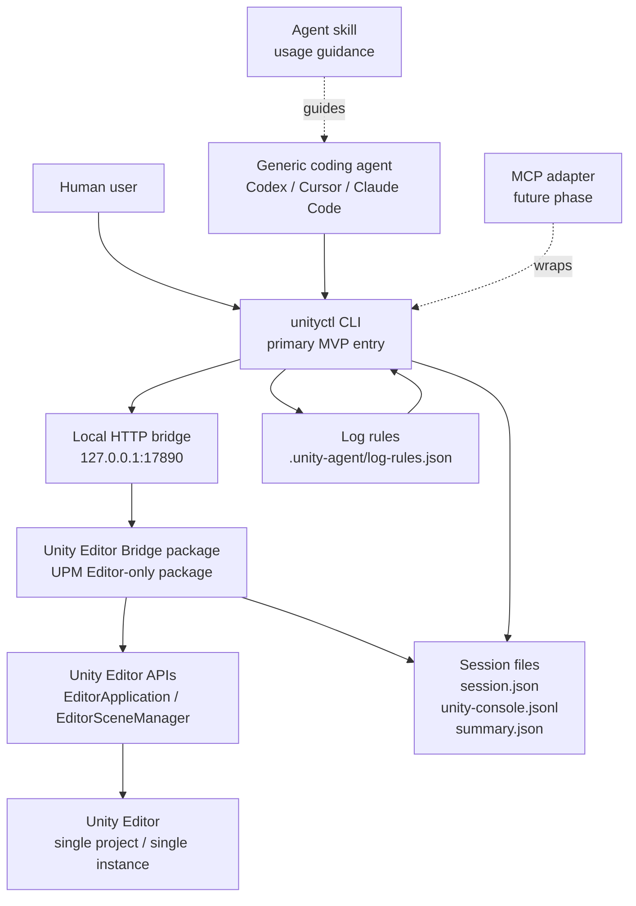

# Unity Agent Bridge MVP Entry Implementation Plan

> **For agentic workers:** REQUIRED SUB-SKILL: Use superpowers:subagent-driven-development (recommended) or superpowers:executing-plans to implement this plan task-by-task. Steps use checkbox (`- [ ]`) syntax for tracking.

**Goal:** 提供 Unity Agent Bridge MVP 的入口计划，用来串联运行控制与运行观测两份子计划，并定义整体执行顺序、阶段验收和交接方式。

**Architecture:** 本入口计划不重复子计划中的代码细节，只作为执行导航。MVP 分两阶段：先实现 `Unity Editor Control`，让外部 agent 能稳定控制单个 Unity Editor；再实现 `Unity Runtime Observability`，让每次 PlayMode 运行产生 session-based 落盘日志与 summary。

**Tech Stack:** Unity Editor C# UPM package、Python `unityctl` CLI managed by `uv`、localhost HTTP bridge、JSON/JSONL、pytest、Unity EditMode tests。

---

## 入口说明

这是 Unity Agent Bridge MVP 的总入口计划。

本计划的作用：

- 说明两个子计划的关系
- 明确执行顺序
- 给 agentic worker 一个统一入口
- 避免直接跳进第二阶段导致依赖缺失
- 定义每个阶段完成后应检查什么

本计划不包含完整代码实现步骤。具体实现必须进入对应子计划执行。

## 总体架构图



架构要点：

- `unityctl CLI` 是 MVP 的主入口，优先服务通用 coding agent。
- `MCP adapter` 和 `Agent skill` 是后续适配层，不是第一版核心协议。
- `Unity Editor Bridge package` 是少量侵入的 Editor-only UPM package，不进入 runtime build。
- `Local HTTP bridge` 只监听本机地址，第一版固定为 `http://127.0.0.1:17890`。
- `Session files` 是运行观测的最终事实来源，agent 应优先读取落盘文件进行复盘。
- Python CLI 使用 `uv` 管理；除非命令显式使用 `--project`，`uv run unityctl ...` 默认在 `src/unityctl` 目录下执行。
- 第一版只支持单 Unity project、单 Unity Editor instance。

## Monorepo 完整目录设计

```text
UnityRunBridge/
  README.md
  LICENSE
  CHANGELOG.md
  .gitignore

  packages/                         # Unity UPM packages
    com.elex.unity-agent-bridge/
      package.json
      README.md
      CHANGELOG.md
      Documentation~/
        index.md

      Editor/
        UnityAgentBridge.asmdef
        BridgeConfig.cs
        BridgeResponse.cs
        BridgeServer.cs
        EditorStateProvider.cs
        PlayModeController.cs
        SceneController.cs
        SessionController.cs
        SessionLogWriter.cs

      Tests/
        Editor/
          UnityAgentBridge.Tests.asmdef
          EditorStateProviderTests.cs
          SceneControllerTests.cs
          SessionControllerTests.cs

  src/
    unityctl/                       # Python CLI, MVP primary entry for agents
      pyproject.toml
      uv.lock
      unityctl/
        __init__.py
        cli.py
        client.py
        editor.py
        session.py
        summary.py
      tests/
        test_client.py
        test_cli.py
        test_editor.py
        test_session.py
        test_summary.py

  adapters/
    mcp/                            # future phase: MCP wrapper around unityctl
      README.md
      pyproject.toml
      unity_agent_bridge_mcp/
        __init__.py
        server.py
        tools.py
      tests/

  skills/
    unity-agent-bridge/               # future phase: guide generic agents
      SKILL.md

  schemas/
    session.schema.json
    unity-console-log.schema.json
    summary.schema.json
    log-rules.schema.json

  docs/
    unity-agent-bridge-project-context.md
    architecture/
      overview.md
      protocol.md
      security.md
    superpowers/
      plans/
        2026-07-01-unity-agent-bridge-entry.md
        2026-06-30-unity-editor-control.md
        2026-06-30-unity-runtime-observability.md

  examples/
    unity-project-manifest/
      manifest.json
    sessions/
      session.json
      unity-console.jsonl
      summary.json

  scripts/
    run-python-tests.sh
    run-unity-editmode-tests.sh
    package-upm.sh

  .github/
    workflows/
      python-tests.yml
      unity-package-check.yml
```

目录边界：

- `packages/com.elex.unity-agent-bridge/` 是 Unity 项目实际安装的 UPM package。
- `src/unityctl/` 是 MVP 给通用 coding agent 使用的主入口。
- `adapters/mcp/` 是后续 MCP adapter，不属于第一版必须实现范围。
- `skills/unity-agent-bridge/` 是后续给 agent 的使用说明层，不属于第一版必须实现范围。
- `schemas/` 用于固定 `session.json`、`unity-console.jsonl`、`summary.json`、`log-rules.json` 的数据契约。
- `examples/` 用于给新用户和新 agent 提供最小可读样例。

MVP 第一版实际需要创建：

```text
packages/com.elex.unity-agent-bridge/
src/unityctl/
schemas/
docs/
examples/
scripts/
```

MVP 第一版暂不需要创建：

```text
adapters/mcp/
skills/unity-agent-bridge/
.github/workflows/
```

UPM Git 引用方式：

```json
{
  "dependencies": {
    "com.elex.unity-agent-bridge": "https://github.com/your-org/UnityRunBridge.git?path=/packages/com.elex.unity-agent-bridge#v0.1.0"
  }
}
```

本地开发引用方式：

```json
{
  "dependencies": {
    "com.elex.unity-agent-bridge": "file:/path/to/UnityRunBridge/packages/com.elex.unity-agent-bridge"
  }
}
```

## 子计划索引

### Phase 1: Unity Editor Control

计划文件：

- `docs/superpowers/plans/2026-06-30-unity-editor-control.md`

目标：

- 创建 Editor-only UPM package
- 创建 Python `unityctl` CLI
- 启动 Unity Editor
- 查询 Editor status
- 控制 PlayMode：`play`、`stop`、`pause`、`resume`
- 打开指定 scene
- 暴露固定 localhost HTTP bridge：`http://127.0.0.1:17890`

完成后应具备：

```bash
cd /Users/elex-mb0203/MyWork/my_github/UnityRunBridge/src/unityctl
uv run unityctl status
uv run unityctl play
uv run unityctl pause
uv run unityctl resume
uv run unityctl stop
uv run unityctl open-scene Assets/Scenes/Login.unity
```

完成标准：

- Python tests 通过
- Unity EditMode tests 通过
- Unity package 编译通过
- 打开的 Unity Editor 可以通过 `unityctl` 控制 PlayMode
- `BridgeServer` 在 domain reload 和 Editor quit 时能清理 listener

### Phase 2: Unity Runtime Observability

计划文件：

- `docs/superpowers/plans/2026-06-30-unity-runtime-observability.md`

依赖：

- 必须先完成 Phase 1

目标：

- CLI 创建 session 目录
- 生成 `session.json`
- Bridge 接收 session path
- Bridge 捕获 Unity Console logs
- 写入 `unity-console.jsonl`
- CLI 生成 `summary.json`
- 支持 `.unity-agent/log-rules.json` 的 `ignore` 规则
- 支持 `unityctl logs/errors/summary`

完成后应具备：

```bash
cd /Users/elex-mb0203/MyWork/my_github/UnityRunBridge/src/unityctl
uv run unityctl play \
  --project "/path/to/unity/project" \
  --session login-flow \
  --scene Assets/Scenes/Login.unity \
  --task "verify login flow"

uv run unityctl stop \
  --project "/path/to/unity/project" \
  --session-path "<ProjectRoot>/.unity-agent/sessions/<sessionId>"

uv run unityctl logs --session-path "<ProjectRoot>/.unity-agent/sessions/<sessionId>" --limit 100
uv run unityctl errors --session-path "<ProjectRoot>/.unity-agent/sessions/<sessionId>"
uv run unityctl summary --session-path "<ProjectRoot>/.unity-agent/sessions/<sessionId>"
```

完成标准：

- Python tests 通过
- Unity EditMode tests 通过
- `session.json` 能创建
- `unity-console.jsonl` 能落盘
- `summary.json` 能生成
- `Warning` 不导致 failed
- `Error` 默认进入 `problem_detected`
- `Exception` 和 `Assert` 默认进入 `failed`
- `ignore` rules 可以排除预期错误

## 总体执行顺序

### Task 1: 执行 Phase 1

**Files:**
- Read: `docs/superpowers/plans/2026-06-30-unity-editor-control.md`

- [ ] **Step 1: 打开 Phase 1 子计划**

Run:

```bash
cd /Users/elex-mb0203/MyWork/my_github/UnityRunBridge
sed -n '1,220p' docs/superpowers/plans/2026-06-30-unity-editor-control.md
```

预期：能看到 `Unity Editor Control 实现计划` 的目标、范围和文件结构。

- [ ] **Step 2: 按 Phase 1 子计划逐 task 执行**

执行方式：

```text
使用 superpowers:subagent-driven-development 或 superpowers:executing-plans
逐个执行 docs/superpowers/plans/2026-06-30-unity-editor-control.md 中的 Task 1-8
```

预期：Phase 1 子计划中的每个 task 都完成并提交。

- [ ] **Step 3: 运行 Phase 1 验收命令**

Run:

```bash
cd /Users/elex-mb0203/MyWork/my_github/UnityRunBridge/src/unityctl
uv run pytest tests -v
```

预期：全部 Python tests 通过。

在已安装 Bridge package 的 Unity project 中运行：

```bash
"${UNITY_BIN:?set UNITY_BIN}" -batchmode -projectPath "${UNITY_PROJECT:?set UNITY_PROJECT}" -runTests -testPlatform EditMode -testResults "/tmp/unity-agent-bridge-editmode.xml" -quit
```

预期：全部 Unity EditMode tests 通过。

- [ ] **Step 4: 手动验证 Phase 1 CLI**

正常打开 Unity project，等待 Bridge 启动后运行：

```bash
cd /Users/elex-mb0203/MyWork/my_github/UnityRunBridge/src/unityctl
uv run unityctl status
uv run unityctl play
uv run unityctl pause
uv run unityctl resume
uv run unityctl stop
```

预期：每条命令退出码为 `0`，并输出包含 `"ok": true` 的 JSON。

- [ ] **Step 5: Phase 1 完成提交**

Run:

```bash
git status --short
```

预期：没有未提交的 Phase 1 实现文件。若有文档或实现文件需要提交，按 Phase 1 子计划中的 commit 节奏提交。

### Task 2: 执行 Phase 2

**Files:**
- Read: `docs/superpowers/plans/2026-06-30-unity-runtime-observability.md`

- [ ] **Step 1: 确认 Phase 1 已完成**

Run:

```bash
cd /Users/elex-mb0203/MyWork/my_github/UnityRunBridge
test -f src/unityctl/unityctl/cli.py
test -f packages/com.elex.unity-agent-bridge/Editor/BridgeServer.cs
```

预期：两个 `test -f` 命令退出码都是 `0`。

- [ ] **Step 2: 打开 Phase 2 子计划**

Run:

```bash
cd /Users/elex-mb0203/MyWork/my_github/UnityRunBridge
sed -n '1,220p' docs/superpowers/plans/2026-06-30-unity-runtime-observability.md
```

预期：能看到 `Unity Runtime Observability 实现计划` 的目标、前置条件、范围和数据约定。

- [ ] **Step 3: 按 Phase 2 子计划逐 task 执行**

执行方式：

```text
使用 superpowers:subagent-driven-development 或 superpowers:executing-plans
逐个执行 docs/superpowers/plans/2026-06-30-unity-runtime-observability.md 中的 Task 1-6
```

预期：Phase 2 子计划中的每个 task 都完成并提交。

- [ ] **Step 4: 运行 Phase 2 验收命令**

Run:

```bash
cd /Users/elex-mb0203/MyWork/my_github/UnityRunBridge/src/unityctl
uv run pytest tests -v
```

预期：全部 Python tests 通过。

在已安装 Bridge package 的 Unity project 中运行：

```bash
"${UNITY_BIN:?set UNITY_BIN}" -batchmode -projectPath "${UNITY_PROJECT:?set UNITY_PROJECT}" -runTests -testPlatform EditMode -testResults "/tmp/unity-agent-bridge-editmode.xml" -quit
```

预期：全部 Unity EditMode tests 通过。

- [ ] **Step 5: 手动验证 session-based observability**

正常打开 Unity project，等待 Bridge 启动后运行：

```bash
cd /Users/elex-mb0203/MyWork/my_github/UnityRunBridge/src/unityctl
uv sync
SESSION_OUTPUT="$(uv run unityctl play --project "$UNITY_PROJECT" --session login-flow --scene Assets/Scenes/Login.unity --task "verify login flow")"
SESSION_PATH="$(python3 -c 'import json,sys; print(json.load(sys.stdin)["sessionPath"])' <<< "$SESSION_OUTPUT")"
uv run unityctl stop --project "$UNITY_PROJECT" --session-path "$SESSION_PATH"
uv run unityctl logs --session-path "$SESSION_PATH" --limit 20
uv run unityctl errors --session-path "$SESSION_PATH"
uv run unityctl summary --session-path "$SESSION_PATH"
test -f "$SESSION_PATH/session.json"
test -f "$SESSION_PATH/unity-console.jsonl"
test -f "$SESSION_PATH/summary.json"
```

预期：

- `unityctl play` 输出 `sessionId` 和 `sessionPath`。
- `unityctl stop` 生成 `summary.json`。
- `logs/errors/summary` 命令退出码为 `0`。
- 三个 `test -f` 命令退出码都是 `0`。

- [ ] **Step 6: Phase 2 完成提交**

Run:

```bash
git status --short
```

预期：没有未提交的 Phase 2 实现文件。若有文档或实现文件需要提交，按 Phase 2 子计划中的 commit 节奏提交。

## MVP 完成定义

MVP 完成需要同时满足：

- Phase 1 完成并通过验收
- Phase 2 完成并通过验收
- 通用 coding agent 可以通过 `unityctl` 控制 Unity Editor
- 通用 coding agent 可以读取本次运行的 `session.json`
- 通用 coding agent 可以读取本次运行的 `unity-console.jsonl`
- 通用 coding agent 可以读取本次运行的 `summary.json`
- Unity Bridge package 不进入 runtime build
- Unity Bridge package 不修改业务代码

## 暂不进入的后续方向

以下方向不属于本 MVP：

- 游戏画面截图
- 多模态截图理解
- UI tree 结构化
- 自动点击/输入
- 录制与回放
- gameplay command bridge
- MCP tools
- 多 Unity 项目 discovery
- CI/CD 集成

这些方向可以在 MVP 验证后再拆成独立计划。

## Self-Review

需求覆盖：

- 汇总两个子计划：已覆盖。
- 明确入口作用：已覆盖。
- 明确执行顺序：已覆盖，Phase 1 先于 Phase 2。
- 明确完成标准：已覆盖，包含 tests、手动 CLI 验收和 session 文件验收。
- 避免重复实现细节：已覆盖，本计划只引用子计划，不复制完整实现。

占位符扫描：

- 文档没有未解决的占位符标记。

类型一致性：

- 子计划文件名一致。
- CLI 命令名与两个子计划保持一致。
- session 文件名与运行观测计划保持一致。

## 执行交接

计划已保存到 `docs/superpowers/plans/2026-07-01-unity-agent-bridge-entry.md`。有两种执行方式：

1. **Subagent-Driven（推荐）**：每个 task 派一个 fresh subagent，任务之间进行 review，迭代更快。
2. **Inline Execution**：在当前会话中使用 `superpowers:executing-plans` 执行，按 checkpoint 分批 review。

请选择执行方式。
